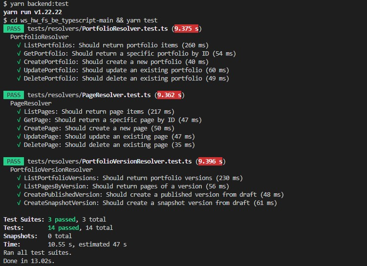
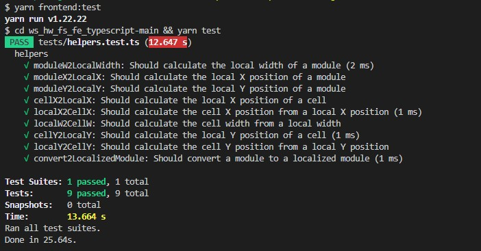

# Digication Work Sample

Thank you for inviting me to this exciting assessment process and would love to submit my technical solution for your review. I have implemented versioning entities and APIs in managing portfolios and pages in the backend and extended the algorithm by ensuring grid layout system with specific movement and collision requirements provided.

## Backend: TypeScript, GraphQL, TypeORM

### Data Models

- **Portfolio**: Contains fields `id`, `name`, and `url`.
- **Page**: Contains fields `id`, `name`, `url`, and a reference to the `PortfolioVersion` it belongs to.
- **PortfolioVersion**: Contains fields `id`, `type`, and references to `Portfolio` and `Pages`.

### Relationships

- A `Portfolio` can have multiple `PortfolioVersions`.
- A `PortfolioVersion` can have multiple `Pages`.
- A `Page` belongs to exactly one `PortfolioVersion`.

### Versioning of Pages

To support versioning, I introduced a new `PortfolioVersion` entity. This entity allows for multiple versions of a set of pages, including `DRAFT`, `PUBLISHED`, and `SNAPSHOT` versions.

### Implementation

1. **Entity Modifications**:

   - Updated `PortfolioEntity` to include a one-to-many relationship with `PortfolioVersionEntity`.
   - Updated `PortfolioVersionEntity` to include a one-to-many relationship with `PageEntity`.

2. **Cascade Deletions**:

   - Configured cascading delete rules to ensure related entities are deleted when a portfolio is deleted.
   - Added manual deletion logic in the `deletePortfolio` mutation to handle the constraints properly.

3. **Resolvers**:
   - Implemented queries and mutations to create versions, move pages between versions, and fetch versions and pages.
   - Included detailed error handling and validations.

### Queries and Mutations

- **Queries**:

  - `listPortfolios`: Fetch all portfolios with their versions.
  - `listPages`: Fetch all pages algonside their versions.
  - `getPortfolio`: Fetch a specific portfolio by ID with its versions.
  - `getPage`: Fetch a specific page by ID.
  - `listPortfolioVersions`: Fetch all versions of a portfolio.
  - `listPagesByVersion`: Fetch all pages of a specific version.

- **Mutations**:
  - `createPortfolio`: Create a new portfolio.
  - `createPage`: Create a new page in the draft version.
  - `createPublishedVersion`: Create a published version from the draft version.
  - `createSnapshotVersion`: Create a snapshot version from the draft version.
  - `updatePortfolio`: Update a portfolio by ID
  - `updatePage`: Update a portfolio by ID
  - `deletePortfolio`: Delete a portfolio along with its versions and pages.
  - `deletePage`: Delete a portfolio along with its versions and pages.

### Testing

I used Jest for unit testing to make sure that all functionalities work as expected. I also created additional test helpers including creating portfolios, versions, moving pages between versions and deleting portfolios along with their related entities.

## Frontend: TypeScript, React, Drag & Drop

### Definition

1. **Layout container**: A 12-column grid layout with 10px gutter size. The container can contain multiple module objects.
2. **Module**: A rectangle object with boundary properties relative to the layout container.
3. **Module boundary properties**:
   - **x**: The left coordinate value of the module relative to the layout container.
   - **y**: The top coordinate value of the module relative to the layout container.
   - **w**: The width of the object in grid columns.
   - **h**: The height of the object in pixels.

### Implementation

1. **Drag and Drop**:

   - Implemented module movement using the HTML Drag and Drop API.
   - Ensured modules snap to the grid column units.

2. **Collision Detection**:
   - Implemented logic to detect and prevent module overlaps.
   - Maintained the required gutter size between modules.

### Testing

- Ensured modules can move within the layout container and snap to the grid.
- Verified that modules do not overlap and maintain the required gutter size.

